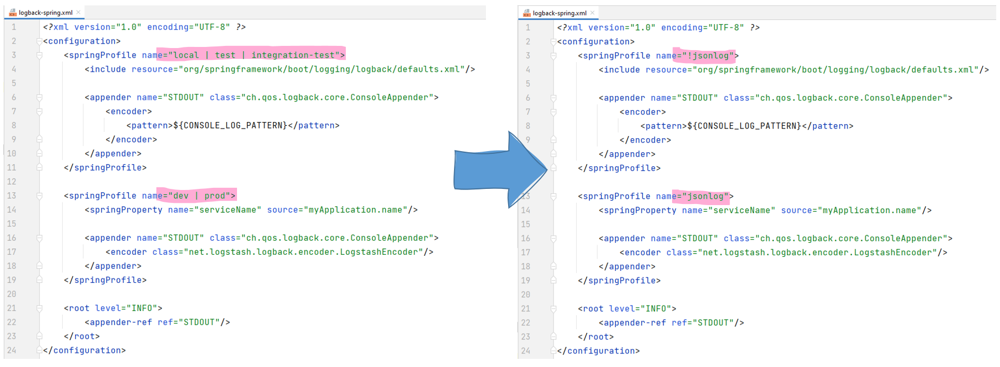
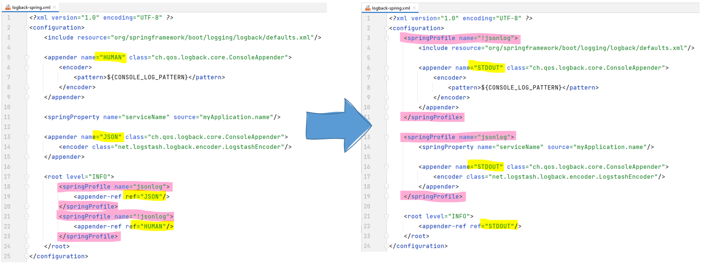

# Spring MVC Structured Logging Example

A small example project to facilitate discussions about structured logging.

## Execute

Activate the Spring profile `jsonlog` to print logs in JSON format. E.g.

```bash
mvn spring-boot:run -Dspring-boot.run.profiles=jsonlog
```

or if you do not want to use maven

```bash
SPRING_PROFILES_ACTIVE=jsonlog java -jar target/structured-logging-0.0.1-SNAPSHOT.jar 
```

If the profile `jsonlog` is not set the application logs in default Spring Boot fashion which is very human friendly,
but you will not see attributes that only go into the JSON output.

## Logback Config

Logs in JSON format can be hard to read for a human beings. Switching over to "classic" logs can be very beneficial when
using the application locally or when running (unit) tests. Spring Boot provides `<springProfile>` elements for our
Logback configuration, so we can use Spring profiles to control the format of our logs.

I want to highlight two design decisions regarding the Logback config file (`src/main/resources/logback-spring.xml`).

### Spring profile names

I observed teams using profile names like `dev` and `prod` to print JSON logs when the application is deployed, but use
human-readable logs when running locally with `local`, `test`, or `integration-test`. While I concur with the intent, I
suggest specifying an explicit on/off profile for logging (right-hand side). It decouples logging from other
configuration aspects. E.g. I could choose to print JSON logs while running unit tests to get extra information without
adjusting my log statements. Also, whenever I introduce a new profile (e.g. introduction of a new "integration" stage) I
do not need to change my Logback configuration accordingly (Single Responsibility Principle = one reason to change).


### Appender names

If we follow my suggestion regarding Spring profile names, we could argue to give the appenders more speaking names and
choose the most fitting appender in the `<root>` element (left-hand side). However, I prefer to declare the same name
depending on Spring profiles and use it in the `<root>` elements (right-hand side). If the appender is used in
the `<root>` element, it **has** to be declared before, otherwise Logback throws an error at startup. I consider this a
good thing as it prevents making a mistake by which **no** appender is specified in the `<root>` element.


## Log statements

This example project utilizes three different tools to create structured logs:

1. **Mapped Diagnostic Context (MDC)** - A stateful map to store attributes (held in ThreadLocal)
2. **Structured Arguments** - A stateless way to add values to the message and JSON at the same time
3. **Markers** - A stateless way to add values to the JSON only

To learn more, I recommend the excellent article https://www.innoq.com/en/blog/structured-logging/
by [Jochen Christ](https://github.com/jochenchrist). While I agree with Jochen that Markers have an unfavorable API, I
want to point out, that using structured arguments in all situations may disturb static analyzers that analyze log
statements (*"More arguments provided (2) than placeholders specified (0)"*). This might change (at least for IntelliJ
IDEA) as Jochen filed a [bug report](https://youtrack.jetbrains.com/issue/IDEA-280562) with JetBrains. As an alternative
I propose to use a thin abstraction layer
like [`JsonAttributeMarker.java`](src/main/java/de/sebsprenger/structuredlogging/util/JsonAttributeMarker.java).

You can find usage examples of structured arguments and markers
in [`OrderDatabase.java`](src/main/java/de/sebsprenger/structuredlogging/adapter/secondary/OrderDatabase.java)